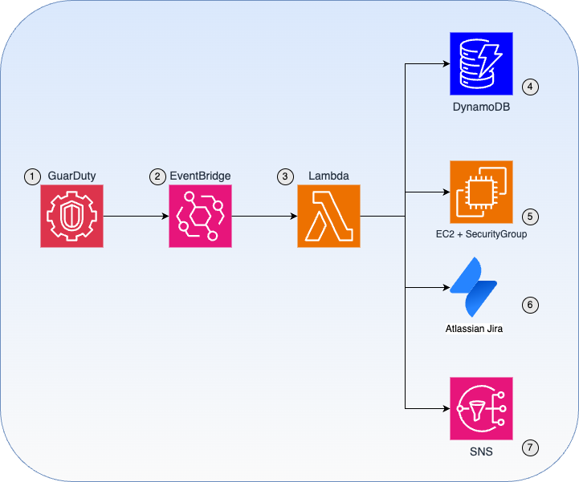

# How to use Amazon GuardDuty to automatically block suspicious EC2 hosts


Amazon GuardDuty is a serverless tool using machine learning to find threats and anomalies in your AWS account. What I am trying to show in this repo is how combining GuardDuty findings with automation can help take actions and mitigate the risks as soon as they are detected. Therefore, giving time for security team to do the forensic analysis without the risk of being operationally overwhelmed. In this article we will use AWS security group to isolate the suspected node without stopping it.  Therefore, a snapshot fo the instance's EBS disk can be mounted on a node EC2 as secondary disk for further analysis with appropriate forensic tools.

The solution will be deployed with Terraform template.

The full article can be found here.


# Solution Overview





The integration workflow with GuardDuty works, as shown in the diagram, like this:

* 1 GuarDuty finding is created when a suspicious activity is detected on EC2.

* 2 EventBridge (Formerly known as CloudWatch Event) is configured to filter GuarDuty events with custom pattern filtering to capture only frequent EC2 related findings.

* 3 Lambda function is invoked by BridgeEvent and parses GuarDuty findings.

* 4 The lambda function stores finding's important metadata in DynamoDB if it doesn't exist already.

The lambda function isolates the EC2 node by converting existing (and new) traffic to "untracked" connections as explained in the re:Post.

The lambda function will open a Jira Issue to keep track of the finding

The lambda function sends an email notification using AWS SNS


# Deployment of the solution

1. Update variables.tf with correct values
2. Deployment:

    a. Option 1 (Reuse the provided packages.zip)

        ```
        terraform init
        terraform apply
        ```

    b. Install Python packages required by Lambda function

        ```
        mkdir -p lambda_code/python

        CFLAGS='-march=x86-64' pip install atlassian-python-api -t lambda_code/python/

        cd  lambda_code/

        zip -r packages.zip python
        ```
3. Generate GuardDuty findings

From a shell sesison inside EC2 running VM do a port scan to generate GuardDuty

```
ssh ec2-user@3.84.236.119     -i ~/.aws/mkerbachi-us-east-1-219113380444.pem  'sudo nmap www.google.ca'
Starting Nmap 7.93 ( https://nmap.org ) at 2024-09-10 00:35 UTC
Nmap scan report for www.google.ca (64.233.180.94)
Host is up (0.0029s latency).
Other addresses for www.google.ca (not scanned): 2607:f8b0:4004:c21::5e
rDNS record for 64.233.180.94: pe-in-f94.1e100.net
Not shown: 997 filtered tcp ports (no-response), 1 filtered tcp ports (net-unreach)
PORT    STATE SERVICE
80/tcp  open  http
443/tcp open  https
```

